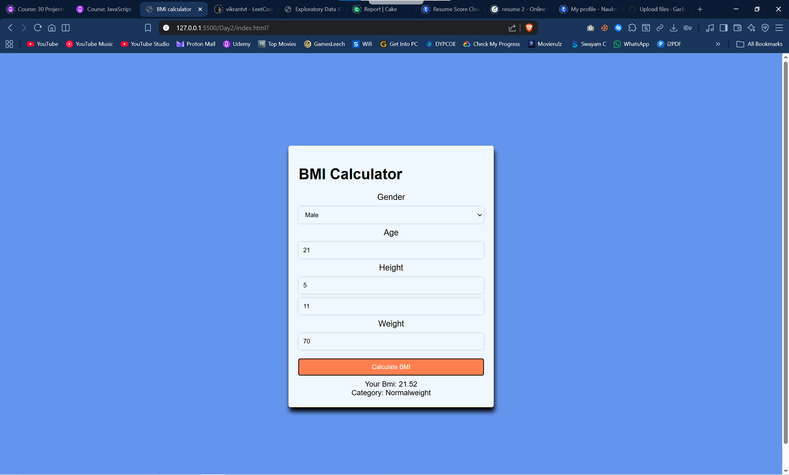

#  BMI Calculator

Day 2 of my **1 Project Per Day Challenge**

A simple and responsive **BMI (Body Mass Index) Calculator** built using HTML, CSS, and JavaScript. It allows users to input their details and instantly get their BMI along with the health category.

---

##  Features
- Input fields for gender, age, height & weight
- Calculates BMI instantly
- Displays BMI value with category (Underweight, Normal, Overweight, etc.)
- Clean and user-friendly UI

---

##  Tech Stack
- HTML
- CSS
- JavaScript

---

##  Output



---

##  How to Run
1. Clone the repository  
   ```bash
   git clone https://github.com/your-username/bmi-calculator.git
